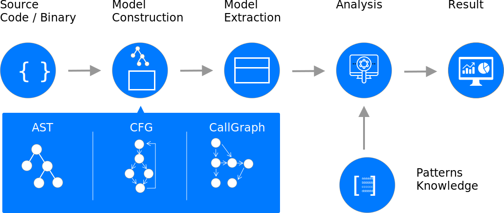
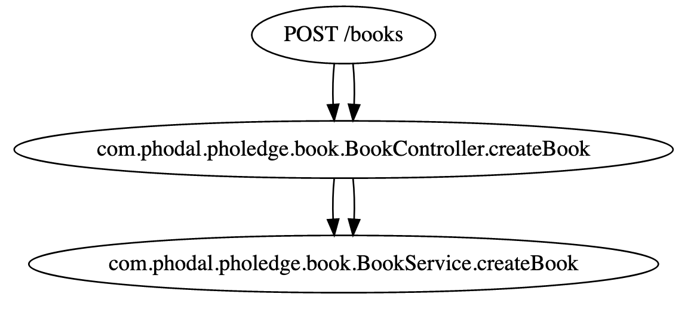
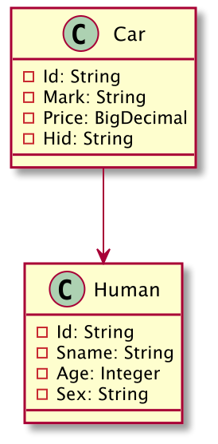
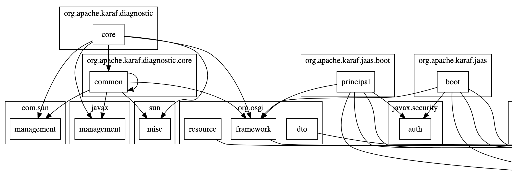
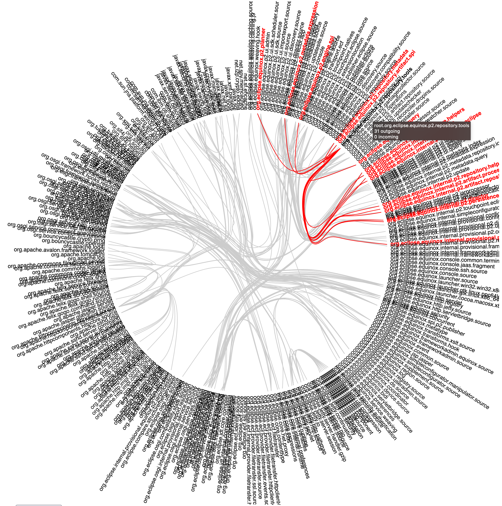
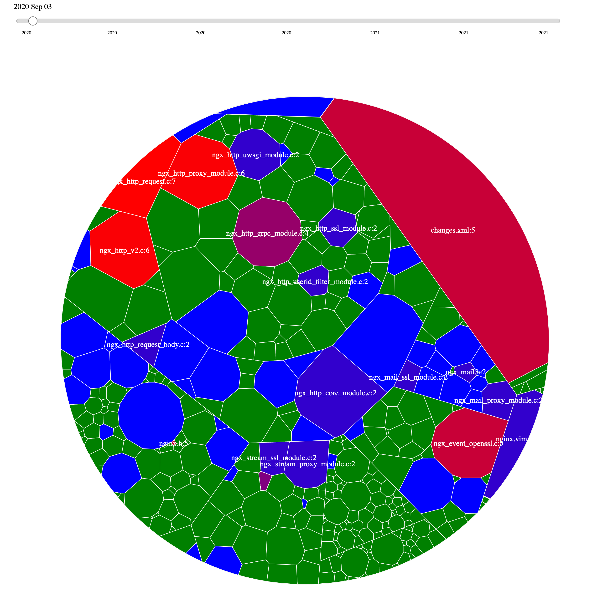
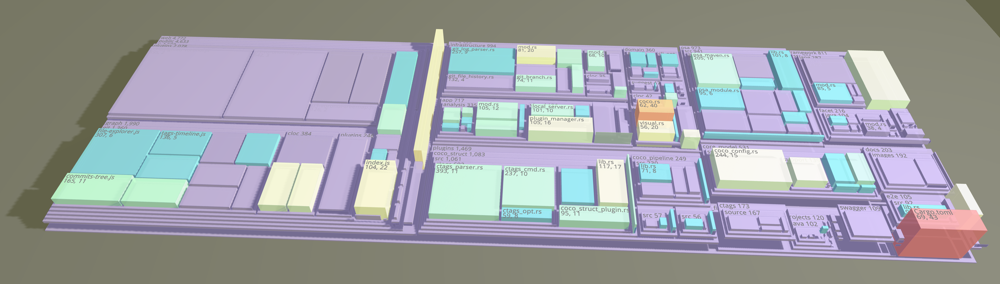
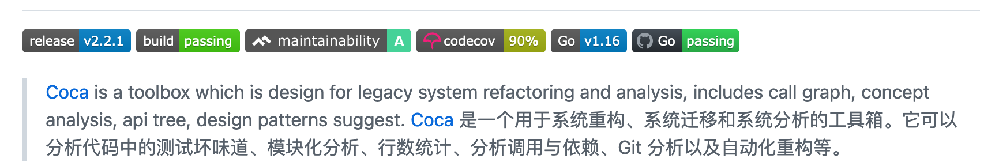

# 《代码分析与自动化重构》

PS：根据过去编写 Modernizing 相关的开源工具里，编写的《代码分析与自动化重构》指南。

遗留系统的现代化演进是一门艺术。在日常的软件开发里，我们经常会遇到一系列的问题：

* 如何解决人类智商不够的问题？模式、原则和工具
* 谁应该去解决代码的问题？代码
* ……

应对于这些问题，其中的一个解决方案就是：**自动化的工具**，有些人喜欢称之为**器**。支撑这些工具的便是一系列的**原则**与**模式**，将它们融入到工具之中。另外一个解决人成长的方案就是：元元（meta-meta），这是另外一个故事。应对于日常编码而言，它便是代码的分析，以及后续的自动化重构。

代码分析与自动化重构流程：




# 简介

## Why 开源 + 遗留系统现代化工具

**遗留系统是常态**。在大多数公司里，我们所遇到的系统里多数是是遗留系统，来到一个新项目时，可能就需要对他们快速的分析，以提供洞见 —— 写 PPT 汇报。所以，在过去的几年里，我们也沉淀了一系列的遗留系统分析和重构的工具，比如新哥的 Tequila、正在开源的架构分析和守护工具 ArchGuard 等等。除此，在有些重构项目里，还要编写定制的工具来进行分析，诸如于先前我的同事覃宇和俊斌等所写的「[移动应用遗留系统重构](https://juejin.cn/post/6943470229905211422)」 系列。

**技术热情发电**。对多数人而言，我们面临的一个重要挑战则是：拿自己的业余时间来完善工具。

既然要用自己的时间来开发，还和项目没有关系，这种**用爱发电**的事情，用开源的方式最合适了。

## 我们需要怎样的工具？

从对于使用工具的结果来看，我们需要这个现代化工具是：

* **可视化驱动**。快速生成项目的分析结果，并展示出来给开发人员了解现状，还有编写 PPT。
* **必要的交互性**。用于在重构的过程中，寻找合适的切入点。 
* **定制化开发**。
  * 特定坏味道。不同的开发团队会有不同的坏味道，有些坏味道是无法由 SonarQube 这样的工具识别的。
  * 自动化重构。基于已知的坏味道，对应的代码位置信息，对代码进行自动化重构。
* **适当的语法精准度**。更高的语法精准度，意味着更高的开发成本，需要有针对地平衡它们。
* **多平台**。我们用的是 macOS，而多数时候，客户使用的是 Windows。

## 如何开发这样的工具？

这里定义的遗留系统现代化工具包含了这么几部分：语法分析、结果及可视化、自动化重构、架构守护。

### **语法分析**

 对代码进行语法分析，生成特定的语言的数据结构。常用的工具有：Antlr、Ctags、Tree-sitter、Doxygen、CodeQuery 等。一个大致的对比（拍脑袋订的）如下表所示：

| 工具 | 精确度量化 | 开发难度 | 跨语言学习成本 | 添加新语言成本 | 可自动化重构 |
|----|----|----|----|----|----|
| 语言编译器 | 完美 | 低 | 高 | - | Yes |
| Antlr | 极高 | 中 | 中 | 中 | Yes |
| Ctags | 中 | 低 | 低 | 高 | Yes（成本高） |
| Tree-sitter | 高 | 高 | 中 | 高 | Yes（成本高，S） |
| Doxygen | 中 | 低 | 低 | 高 | No |
| CodeQuery | 极高 | 中 | 中 | 高 | Yes（成本高）|

### 结果及可视化

通常来说，我们会出于以下的一些情况，来对遗留系统进行可视化：

* **数值化**。如针对于特定的 smell 进行自动化重构，类似于 SonarQube，常见的模式和原则源自于《重构》一书。在 Coca 里，还引入了在一些论文里看到了**测试的 bad smell**，诸如于没有断言的测试等。
* **可视化依赖**。如针对于代码中的类、包等的依赖情况进行可视化，主要用于分析分层架构等。常用的工具有：PlantUML、Graphviz、D3.js、Echarts 等。
* **代码属性可视化。**如针对于文件的修改频率、大小等属性进行可视化，可以获取诸如于单位时间内的文件变化频率。一个文件经常修改，还大量被引用，那说明它是一个不稳定的类、文件，除了业务变化，最有可能就是设计不合理。
* **其它**。

#### 自动化重构

这一步是可选的，它取决于我们的场景。通常来说，编写这样的功能主要弥补是现代化的 IDE 无法完成的工作，诸如于：

* 多代码库间的未使用类删除。
* 多代码库间的聚类。
* 针对于 CSS 颜色的重构。

#### 架构守护

编写架构的守护规则，以对于系统的架构进行守护，用的工具有：ArchUnit、ArchGuard 等。在参考了 ArchUnit 的语法之后，我们也设计了一个多语言的架构守护工具：[Guarding](https://github.com/modernizing/guarding)。


## 遗留系统现代化工具集

在 [Modernizing](https://github.com/modernizing) 里，我们集合了先前开发的一系列工具。并创建了：[awesome-modernization](https://github.com/modernizing/awesome-modernization) 用于对其它的一系列相关的工具进行收集。

在 Modernizing 里，针对于单个编程语言的工具有：

* 针对于 Java 语言的系统重构、系统迁移和系统分析的工具：[Coca](https://github.com/modernizing/coca)，Go 语言，GitHub stars：691。Coca 是一个“全功能”的重构工具，基于 Antlr 进行语法分析的，除了常规的可视化、调用分析，还可以进行自动化重构。Coca 一名的由来是：对标新哥写的 [Tequila](https://github.com/modernizing/tequila) —— 龙舌兰酒 vs 快乐水。
* 针对于 CSS/LESS/CSS 的分析和自动化重构工具：[Lemonj](https://github.com/modernizing/lemonj)，TypeScript 语言，GitHub stars：128。当时设计的主要目的是：用来对 CSS 中的颜色进行提取，基于 Antlr 的语法树分析，可以用于进行自动化的重构。
* 针对于 MySQL 代码进行自动化分析，并从中构建中 UML，并生成其关系的：[SQLing](https://github.com/modernizing/sqling)，Go 语言，使用 PingCap 的 SQL 解析器解析。当然了，还有一个初始化的针对于 PL/SQL 的版本：[pling](https://github.com/modernizing/pling)。
* 适用于 Ant 转 Maven 的半自动化工具：[Merry](https://github.com/modernizing/merry)，Go 语言 + Antlr。
* 前端规范化改造工具：[Clij](https://github.com/modernizing/clij)，用于一键添加 eslint、husky、lint-staged 等，TypeScript 语言。

针对于多语言的工具，我们有：

* 基于 Antlr 的多语言的语言模型分析工具：[Chapi](https://github.com/inherd/chapi)，Kotlin 语言。其设计的初衷是用于生成 Coca 相同的数据结构，以接入更多的可视化工具。在语法分析上，采用的是 Antlr 进行分析。
* 基于 Doxygen 的多语言分析和可视化工具：Go mod 版本的新哥的 Tequila。其中，还有一系列的迷之代码，需要重构掉。
* 基于 Ctags 的多语言模型分析和可视化工具：[Modeling](https://github.com/modernizing/modeling)，Rust 语言。分析源码，并生成基于模型的可视化依赖。
* 基于 Tree-sitter 的多语言架构守护工具：[Guarding](https://github.com/modernizing/guarding)，Rust 语言。通过自制的 DSL，来对系统架构进行守护。

除此，还有一个在 Inherd 开源小组下开源的：[Coco](https://github.com/inherd/coco)，它主要是通过代码的物理属性：修改频率 + 目录 + 行数来分析系统的工具。以及现在紧锣密鼓开源中的 ArchGuard。

我们使用一系列不同的语言和工具来开发这些软件，因为不同的场景之下，都会有不同的选择。


# 自动化重构：代码分析


代码分析是我们编写自动化重构、架构守护等一系列工具的第一步。而代码分析的方式有多种不同的形态，最常见的是基于源码以及基于编译后的字节码（常见于 Java 语言）的静态程序分析。

通常来说，根据我们的目标获取的信息是不同的，如：类/结构体、成员、函数（含参数、返回值、注解）、引用（import）、表达式等。因此，所选的工具也是不同的：

| 目标 | 语法信息级别 | 可选 工具 |
|----|----|----|
| HTTP API | @注解、参数、类、方法 | 语法分析器（语言自带、三方、Antlr） |
| 领域模型 | 类/结构体、成员等 | 根据不同精度，可以考虑 Ctags、Tree-sitter等 |
| 包、类依赖关系 | 引用、函数调用等。 | Doxygen、 语法分析器等 |
| 调用链 | 全部信息 | 语法分析器（语言自带、三方、Antlr） |

根据我们的不同需求，我们还需要记录语法的位置信息。比如，同样是 HTTP API 的情况下，我们想获取：

* API URI 列表。只需要解析注解即可。
* API 的输入和输出参数。注解 + 解析函数签名。
* API 输入到数据库。注解 + 解析函数签名 + 调用链。

因此，是不是使用语言自带的语法分析器，生成一个完整的模型就行了，如 Java 使用 [Javaparser](https://github.com/javaparser/javaparser)。事情并不是这么简单，如今是微服务时代，每个服务都可能使用不同语言，一个二三十人的研发团队，可能使用 7\~8 种语言 —— 为每个服务挑选合适的语言，老系统 C#、新系统  Java、大数据 Scala、AI 用 Python 等。除此，为某个语言写一个成本也是颇高的，并且用处可能还不大。

所以 ，在不断平衡之间，我们有了一系列的工具选型。

## 编译器前端

> *编译器*粗略分为词法分析，语法分析，类型检查，中间代码生成，代码优化，目标代码生成，目标代码优化。

### 基于语法分析器（parser）

从实现的层面来看，使用官方的 parser 是最准确的 —— 前提是它提供了便利的接口，像 Java 语言好像就没有这样的接口。

* 官方支持。如 [Coca](https://github.com/modernizing/coca) 早期在解析 Golang 时，使用的是 Go 的 [parser](https://pkg.go.dev/go/parser) 包。
* 三方。在 [SQLing](https://github.com/modernizing/sqling) 中，我们使用的 TiDB 的 [parser](https://github.com/pingcap/parser)，它宣称与 MySQL 完全兼容，并尽可能兼容 MySQL 的语法。

使用这一类 parser 比较麻烦的是在于跨语言的支持，每实现一个新的语言，就需要实现一套，不能复用。

## 自制 parser

为了实现更好的跨平台，以及更好玩，选用一个合适的解析器生成器就更“科学” 了。在这一方面，除了传统的 Flex 和 Bison，Antlr 也是一个不错的选择 —— 多语言支持：JavaScript、Golang、Java、Rust 等。

Antlr 社区维护了一个语法库：<https://github.com/antlr/grammars-v4/>，内置了几十种编程语言的 Antlr 语法文件。虽然，部份语法可能不太准确，需要我们手动进行修改，但是依旧可以大大减少我们的编写成本 —— 除了学习 Antlr 是个成本。Antlr 之类工具的迷人之处在于：你可以重温一下《编译原理》，又或者是《计算机程序的构造和解释（SICP）》，毕竟它是编译器的前端部分。你再掌握一下 LLVM 的 API，就可以开发个语言了。它的挑战之处在于，你需要知道语言的各类语法细节，所以也是一个不错的学习新语言语法的机会。

不过，诸如 Java、C++ 等支持在编译时进行代码生成的语言，也会遇到一系列的挫折。诸如于：

* 引用推断。最难受的 `junit.*`需要做一些推断
* 生成工具推断。如 lombok 等

所以，我们需要通过编译过程中的中间表示，来做一些额外的处理。

### 基于**中间表示（IR）**

**IR**-Intermediate Representation（**中间表示**）是程序编译过程中，源代码与目标代码之间翻译的中介。

为了提升语法分析的精准度，就需要应对编译其的代码生成，于是，就需要分析 IR。如：Java 里的 ASM。能对 `.class` 文件进行分析。只是，IR 处理了一些信息，所以如 class 文件里有些内容（如 annotation）好像并不会被记录行号信息，详见：[LineNumberTable Attribute](https://docs.oracle.com/javase/specs/jvms/se8/html/jvms-4.html#jvms-4.7.12)。

 

Java、Android 在编译过程中对于 Annotation 的操作，又或者是在编译后的骚优化，也是 666。

不过，它能完成大部分我们所需要的工作。

## 编辑器语法树

编辑器在做语法高亮的时候，也在做类似的事情。正好，我先前在某 spike 过编辑器 / IDE 的架构和实现。

* Atom/VSCode。主要由 JSON/PList 格式的 TMLanguage（源自 TextMate） + 正则表达式实现，即 [VSCode TextMate](https://github.com/microsoft/vscode-textmate) 和 [Oniguruma](https://github.com/kkos/oniguruma) 共同构成了 VSCode 的一部分语法高亮功能。吐槽一句，非常难以维护。
* Eclipse。需要手写解析器，[FAQ How do I write an editor for my own language?](https://wiki.eclipse.org/FAQ_How_do_I_write_an_editor_for_my_own_language%3F)。
* Intellij IDEA。可以通过  BNF 来添加相应的功能：[Custom Language Support Tutorial](https://plugins.jetbrains.com/docs/intellij/grammar-and-parser.html#define-the-grammar)。
* Vim。由自带的 Vim 脚本 + 正则表达式（类似）来实现，示例：[Rust.vim](https://github.com/rust-lang/rust.vim/blob/master/syntax/rust.vim)
* Emacs。由 Emacs Lisp 语言 + 正则表达式（类似）来实现，示例：[rust-mode](https://github.com/rust-lang/rust-mode/blob/master/rust-mode.el)

只是呢，上述的工具，在离开了编辑器之后，这个 API 嘛，就有些难用了。于是，有一些独立的工具出现了。

### 基于语言服务器（LSP）

虽然，我还没有尝试过使用 LSP 来实现语法分析，但是我尝试构建过一个语言及其 LSP。因此，从理论来说，LSP 也能达成此目的。并且与 Antlr 类似，Microsoft 也维护了一个 LSP 的目录：<https://microsoft.github.io/language-server-protocol/implementors/servers/>。

麻烦的是，不同语言的 LSP 可能由不同的语言来实现，在系统的集成上会比较困难。其所需要的语言运行环境比较多，比如 Java 的就需要一个 JDK/SDK，在编写分析工具时，自动化测试环境搭建起来也比较麻烦。

### Ctags：有限的解析

Ctags 可以快速实现对类、成员的解析，所以它经常被用在 Vim 的语法高亮上。只是呢，使用 Ctags 难以实现支持：某个函数调用了哪些函数、哪些函数被某个函数调用。从流程上，先用 ctags 生成 tags 文件，然后解析这个 tags 文件即可。如下是一个 tags 文件（部分）：

```javascript
MethodInfo	src/coco_struct.rs	/^pub struct MethodInfo {$/;\"	struct	line:21	language:Rust
name	src/coco_struct.rs	/^    pub name: String,$/;\"	field	line:22	language:Rust	struct:MethodInf
```

然后，再写几个正则表达式 match 一下：

```javascript
        Regex::new(r"(?x)/\^([\s]*)
([A-Za-z0-9_.]+)
(,(\s|\t)*([A-Za-z0-9_.]+))*(\s|\t)*
(?P<datatype>[A-Za-z0-9_.<>\[\]]+)").unwrap();
```

因此，在不考虑正则表达式难写和代码精准度的情况下，使用 Ctags 还会存在一些小问题：


1. 版本冲突，如 macOS 环境自带了一个 ctags，需要 override，或者自定义路径。
2. 下载 ctags。特别是如果客户是在内网环境时，又会比较麻烦。

所以，Tree-sitter 成了一个更好的选择：平衡。

### Tree-sitter

Tree-sitter 是一个解析器生成工具和增量解析库。 它可以为源文件构建具体的语法树，并在编辑源文件时有效地更新语法树。这个工具最初是为 Atom 编辑器设计的。Tree-sitter 内置了一个 S  表达式，可以快速构建出我们想要的模型。如下是一个 C# 代码：

```csharp
using Microsoft.CodeAnalysis.CSharp;
using Microsoft.CodeAnalysis.CSharp.Syntax;

[ApiController]
public class SharpingClassVisitor { 

}
```

对应的 S 表达式如下：

```javascript
(using_directive
	(qualified_name) @import-name)

(class_declaration
    (attribute_list (attribute name: (identifier) @annotation.name))?
    name: (identifier) @class-name
)
```

我们在 Guarding 中使用了 Tree-sitter 来实现，示例：\[Guarding Ident\](<https://github.com/modernizing/guarding/tree/master/guarding_ident/src/identify>)，与 Ctags 相比，没有这个环境依赖，会比较清爽。

其在线 Background：<https://tree-sitter.github.io/tree-sitter/playground> 。

## 其它生成工具

除了上述的几类，还有一些可选的工具。

### 文档生成器：Doxygen

Doxygen 是一个适用于 C++、C、Java、Objective-C、Python、IDL、Fortran、VHDL、PHP、C# 和 D 语言的文档生成器。为了生成代码的文档，它需要能支持对于代码进行语法分析。所以，它也内置了**有限**的语法分析功能。

在 [Tequila](https://github.com/modernizing/tequila) 中，是通过分析 Doxygen 生成的文档结果，从而构建出内部的依赖关系。如下是一个 Doxygen 生成的 Graphviz 文件：

```javascript
digraph "Domain::AggregateRootB"
{
 // LATEX_PDF_SIZE
  edge [fontname="Helvetica",fontsize="10",labelfontname="Helvetica",labelfontsize="10"];
  node [fontname="Helvetica",fontsize="10",shape=record];
  Node1 [label="Domain::AggregateRootB",height=0.2,width=0.4,color="black", fillcolor="grey75", style="filled", fontcolor="black",tooltip=" "];
  Node2 -> Node1 [dir="back",color="midnightblue",fontsize="10",style="solid",fontname="Helvetica"];
  Node2 [label="Domain::AggregateRoot",height=0.2,width=0.4,color="black", fillcolor="white", style="filled",URL="$class_domain_1_1_aggregate_root.html",tooltip=" "];
  Node3 -> Node2 [dir="back",color="midnightblue",fontsize="10",style="solid",fontname="Helvetica"];
  Node3 [label="Domain::Entity",height=0.2,width=0.4,color="black", fillcolor="white", style="filled",URL="$class_domain_1_1_entity.html",tooltip=" "];
}
```

解析这个 `dot` 文件，从而生成项目的类与类之间的依赖信息。

### 索引工具：CodeQuery

[CodeQuery](https://github.com/ruben2020/codequery) 是由 GitHub 推出的索引和查询工具，它主要结合了 Ctags 和 Cscope，cscope 可以实现部分语言的表达式（expression）的支持。它试图结合 cscope 和 ctags 提供的功能，提供比 cscope 更快的数据库访问（因为它使用 sqlite）。虽然，我还没有试过，但是应该也是可以玩一玩的。架构如下所示：

 

它结合了 starscope、pyscope、cscope 等多个工具，来实现对于代码的解析。

# 自动化重构：为代码再建个代码模型

为代码建模并不是一件很难的事情，毕竟每个编译器都在重复做同样的事情。

## 从代码到模型

现在，回忆一下你大学学的编译原理 —— 虽然有些人可能和我一样没上过对应的课。

```java
class GFG {
    public static void main(String[] args)
    {
        System.out.println("Hello World!");
    }
}
```

解析成 AST 后，可以用如下的形式来表示（可能没有对照 JVM 里的实现）：

```
CLASS_DEF -> CLASS_DEF [1:0]
|--MODIFIERS -> MODIFIERS [1:0]
|   `--LITERAL_PUBLIC -> public [1:0]
|--LITERAL_CLASS -> class [1:7]
|--IDENT -> GFG [1:13]
`--OBJBLOCK -> OBJBLOCK [1:17]
    |--LCURLY -> { [1:17]
    |--METHOD_DEF -> METHOD_DEF [2:4]
    |   |--MODIFIERS -> MODIFIERS [2:4]
    |   |   |--LITERAL_PUBLIC -> public [2:4]
    |   |   `--LITERAL_STATIC -> static [2:11]
    |   |--TYPE -> TYPE [2:18]
    |   |   `--LITERAL_VOID -> void [2:18]
    |   |--IDENT -> main [2:23]
    |   |--LPAREN -> ( [2:27]
    |   |--PARAMETERS -> PARAMETERS [2:34]
    |   |   `--PARAMETER_DEF -> PARAMETER_DEF [2:34]
    |   |       |--MODIFIERS -> MODIFIERS [2:34]
    |   |       |--TYPE -> TYPE [2:34]
    |   |       |   `--ARRAY_DECLARATOR -> [ [2:34]
    |   |       |       |--IDENT -> String [2:28]
    |   |       |       `--RBRACK -> ] [2:35]
    |   |       `--IDENT -> args [2:37]
    |   |--RPAREN -> ) [2:41]
    |   `--SLIST -> { [2:43]
    |       |--EXPR -> EXPR [3:26]
    |       |   `--METHOD_CALL -> ( [3:26]
    |       |       |--DOT -> . [3:18]
    |       |       |   |--DOT -> . [3:14]
    |       |       |   |   |--IDENT -> System [3:8]
    |       |       |   |   `--IDENT -> out [3:15]
    |       |       |   `--IDENT -> println [3:19]
    |       |       |--ELIST -> ELIST [3:27]
    |       |       |   `--EXPR -> EXPR [3:27]
    |       |       |       `--STRING_LITERAL -> "Hello World!" [3:27]
    |       |       `--RPAREN -> ) [3:41]
    |       |--SEMI -> ; [3:42]
    |       `--RCURLY -> } [4:4]
    `--RCURLY -> } [5:0]
```

对于代码分析来说，我们就是：

1. 构建**类** AST 模型。通过代码分析工具，得到一个类似上述内容的结果，不同的工具得到的详尽程度不同。
2. 基于标准的 AST 构建分析模型。如我们只取类、函数的信息，就需要解析 `CLASS_DEF` 里的 `IDENT` ，以及其 children 中的 `METHOD_DEF` 里的 `IDENT`，遍历-取值，就这么简单。

所以，要构建出一个完善的 AST 及其模型，基本上就是写一个语言的编译器前端。在现代的编程语言里，Rust 能提供一个非常不错的参考，如 Rust 的编译过程是 AST → HIR → MIR → LIR，其官方在引入  MIR 的时候写了一篇博客《[Introducing MIR](https://blog.rust-lang.org/2016/04/19/MIR.html)》

 

在 Rust 编译器里， HIR 相当于是 Rust 的 AST，它在源码的基础上进行解析、宏扩展和名称解析之后生成。如下是 Rust 的 hello, world! 生成的 HIR 表示：

```rust
#[prelude_import]
use std::prelude::rust_2021::*;
#[macro_use]
extern crate std;
fn main() {
        {
                ::std::io::_print(::core::fmt::Arguments::new_v1(&["hello, world!\n"],
                        &[]));
            };
    }
```

基于不同阶段的编构建模型，得到的模型结果是不完全一样的。如果我们想分析编程语言调用系统的库，或者是三方的库，那么从这里得到的才是更精确的 —— 对比于 Java 的 Bytecode。Java 编程过程中对于 Annotation 的处理，也在侧面反应两者的差异之处。所以，想获取准备的代码模型，可以在这的基础上，进一步探索下编程语言的构建。

如此一来，你也就是一个真正的代码专家了。

## 0.1 初始化版本：面向 Java

在和新哥设计第一个 MVP 版本的时候，只是想比 Doxygen/Tequila 更准确地记录 Java 代码的调用链。所以，设计的模型也相当的简单：

```go
type JClassNode struct {
	Package     string
	Class       string
	Type        string
	Path        string
	Fields      []JAppField
	Methods     []JMethod
	MethodCalls []JMethodCall
}
```

如上的历史代码所示，在面向 Java 语言设计，只记录一个类（Class）的名称、包名、类型、路径、成员变量（包含了依赖的类型）、函数/方法、函数调用关系。因为最初只是为依赖设计，所以调用关系只保存在 ClassNode 里。基于 Antlr 这样的解析器生成器之后，其对应的解析代码（Listener 模式）也颇为简单（[java_full_listener.go](https://github.com/modernizing/coca/blob/master/pkg/infrastructure/ast/ast_java/java_full_listener.go)）：

```go
func (s *JavaCallListener) EnterClassDeclaration(ctx *ClassDeclarationContext) {
	currentType = "Class"
	currentClz = ctx.IDENTIFIER().GetText()

	if ctx.EXTENDS() != nil {
		currentClzExtends = ctx.TypeType().GetText()
	}
}
```

从 ClassDef/ClassDecl 中获取  ident 就是类名，如果有 extends 关系的话，再获取 extends 关系。这是一个初始化的版本，所以没有考虑到非常复杂的场景，比如多重继承、泛型等等。

但是，它也让我重新理解了一下，为什么有的语言的语法设计得有点诡异 —— 解析器不好写。

## 1.0 版本：更多的工具，更多的模型

在发布了 Coca 之后，从 GitHub 几百的 stars 和对应的迁移指南 [Migration](https://github.com/phodal/migration) 2.8k 的 stars 来看，这个领域的需求还是相当的旺盛。

所以，我们开发了更多的功能，也一步步陷入了「人类创造的三个系统」的陷阱中。

### 适用于重构的模型

而后，为了生成实现不适用在 IDE 用的重构功能（多代码库引用检测、类移动等），我们又构建了一个新的模型，因为我们就只需要这么多信息：

```go
type JFullMethod struct {
	Name              string
	StartLine         int
	StartLinePosition int
	StopLine          int
	StopLinePosition  int
}

type JField struct {
	Name   string
	Source string
	StartLine         int
	StopLine          int
}

type JPkgInfo struct {
	Name   string
	StartLine         int
	StopLine          int
}
```

这个时候要实现的功能，还是比较简单的，所以并不是那么复杂

### 适用于测试代码坏味道的模型

除了重构之后，在 Coca 中，还有一个非常有意思的特性：测试代码坏味道。测试代码坏味道，是指单元测试代码中的不良编程实践（例如，测试用例的组织方式，实现方式以及彼此之间的交互方式），它们表明测试源代码中潜在的设计问题。简单来说，就是看测试是否有断言？ignore 的测试数量等等。需求不复杂，所以构建的模型也比较简单：

```go
type BSDataStruct struct {
	core_domain.CodeDataStruct

	Functions    []BSFunction
	DataStructBS ClassBadSmellInfo
}

type BSFunction struct {
	core_domain.CodeFunction

	FunctionBody string
	FunctionBS   FunctionBSInfo
}
```

当然了，细节都是魔鬼，比如 `FunctionBSInfo` 长什么样的？

## 2.0 AST 集合：一个臃肿而缓慢的系统

随后，我们试图构建一个更理想的系统，于是就有了「第二个系统」，一个经过精心设计的系统。

### 兼容更多的语言

随着 Coca/Chapi 的演进，陆陆续续想支持 Golang、Java、Python 等语言。于是，一个平凡的 ClassNode 已经变成了 DataStruct：

```go
@Serializable
open class CodeDataStruct(
    var NodeName: String = "",
    var Type: DataStructType = DataStructType.EMPTY,
    var Package: String = "",
    var FilePath: String = "",
    var Fields: Array<CodeField> = arrayOf(),
    var MultipleExtend: Array<String> = arrayOf(),
    var Implements: Array<String> = arrayOf(),
    var Extend: String = "",
    var Functions: Array<CodeFunction> = arrayOf(),
    var InnerStructures: Array<CodeDataStruct> = arrayOf(),
    var Annotations: Array<CodeAnnotation> = arrayOf(),
    var FunctionCalls: Array<CodeCall> = arrayOf(),
    @Deprecated(message = "looking for constructor method for SCALA")
    var Parameters: Array<CodeProperty> = arrayOf(), // for Scala
    var Imports: Array<CodeImport> = arrayOf<CodeImport>(),    // todo: select node useonly imports
    var Extension: JsonElement = JsonObject(HashMap())
) {  
    ...
}
```

一味地进行了兼容设计，导致它变得异常复杂。而和多数系统一样，这种兼容设计并非是最理想的，没有进一步做一些抽象，比如函数的属性，参数、返回类型等，是否能构建 [Type Signature](https://en.wikipedia.org/wiki/Type_signature)？虽然这是一个技术项目，但是也掉入了同样的业务模型的常见问题中。

最后，我尝试将非 Java 语言分离成插件，但是因为 Golang 当时的版本并不支持插件化架构。所以，从形态拆分为了 Java + 其它语言 CLI，并转向了 Rust 语言。

### 更多的模型

既然，原来的模型可能太重了，那么是不是会有新模型。所以，陆陆续续又构建了一系列的模型。如，在设计 Guarding/Modeling 的时候，我们也构建了一个简化的版本：

```rust
#[repr(C)]
#[derive(Serialize, Deserialize, Debug, Clone)]
pub struct CodeClass {
    pub name: String,
    pub package: String,
    pub extends: Vec<String>,
    pub implements: Vec<String>,
    pub constant: Vec<ClassConstant>,
    pub functions: Vec<CodeFunction>,
    pub start: CodePoint,
    pub end: CodePoint
}

#[repr(C)]
#[derive(Serialize, Deserialize, Debug, Clone)]
pub struct CodeFunction {
    pub name: String,
    // todo: thinking in modifier
    pub vars: Vec<String>,
    pub start: CodePoint,
    pub end: CodePoint
}
```

在这个版本里，使用的是 Tree-sitter 没有函数调用，所以显得非常简单 —— 只是记录基本的类、函数信息等，又是一个非常简单的初始化版本。

## 3.0 进行中的向下抽象：MIR <=> AST

既然，从 AST 做合集太复杂，那么是不是往下钻，寻找更 common 的元素，就能获得更通用的结果，毕竟最后运行在机器上的是一样的。

所以，这就成为了 2022 年的一个潜在的业余乐趣，如果你有兴趣，欢迎到 GitHub 上讨论：[https://github.com/modernizing/kernel](https://github.com/modernizing/kernel)

### 潜在的路：MIR

在这一方面，Rust 编译器的 MIR 就是一个不错的参考，它基于控制流图、也没有嵌套表达式，并且所有类型都是完全显式的 —— 更多的细节可以查看官方的文档：[Rust MIR](https://rustc-dev-guide.rust-lang.org/mir/index.html)。除此，你可以在 <https://play.rust-lang.org/>  里，查看 Rust 在 HIR、MIR、LLVM IR 不同阶段的形式，当然直接诗源码是最简单的。如下是一段 Rust 的代码（本来应该用 Hello, world!，但是它更复杂）。

```rust
fn main() {
    let mut vec = Vec::new();
    vec.push(1);
    vec.push(2);
}
```

生成的 CFG 示例

```javascript
    ...
    bb0: {
        _1 = Vec::<i32>::new() -> bb1;
    }

    bb1: {
        _3 = &mut _1; 
        _2 = Vec::<i32>::push(move _3, const 1_i32) -> [return: bb2, unwind: bb5];
    }

    bb2: {
        _5 = &mut _1;                    
        _4 = Vec::<i32>::push(move _5, const 2_i32) -> [return: bb3, unwind: bb5];
    }
    ...
```

在这个阶段，MIR 比 AST 添加了更完整的细节 —— 我们能知道 `push` 方法是从哪里来的，不需要自己做一些推断。

与之相类似的，还有一个名为 [MIR Project](https://github.com/vnmakarov/mir) 的项目更有意思，它尝试建立多语言的抽象。只是从形式上来看，它接近于 LIR：

```clike
hello_m:  module
          import printf
hello:    func i64
          local i64:r # local variable has to be i64
# prototype of printf
p_printf: proto i32, p:fmt
format:   string "hello, world\n"
          call p_printf, printf, r, format
          ret r
          endfunc
          endmodule
```

不过，在代码模型上，还是接近于 MIR 的：

```clike
/* Function definition */
typedef struct MIR_func {
  const char *name;
  MIR_item_t func_item;
  size_t original_vars_num;
  DLIST (MIR_insn_t) insns, original_insns;
  uint32_t nres, nargs, last_temp_num, n_inlines;
  MIR_type_t *res_types;
  char vararg_p;           /* flag of variable number of arguments */
  char expr_p;             /* flag of that the func can be used as a linker expression */
  VARR (MIR_var_t) * vars; /* args and locals but temps */
  void *machine_code;      /* address of generated machine code or NULL */
  void *call_addr;         /* address to call the function, it can be the same as machine_code */
  void *internal;          /* internal data structure */
} * MIR_func_t;
```

它让我重新思考起，我如何去组件 Struct/Class 和 Function 的关系？从 AST 的层面来说，这个不好解决，但是从 MIR/LIR 的话，这个问题就变得异常简单了 —— 在底层没有继承。

所以，我们应该如何去设计这样一个模型呢？

### 还有 CLR 和 Graal IR ?

在先前设计 Chapi 的期间，鹏飞推荐了一本书《CLR via C#》，在设计 Chapi 的时候，参考了一部分。简单来说，就是 Microsoft .NET Framework 里构建了一个**公共语言运行时（Common Language Runtime，CLR）**。其核心功能（如内存管理、程序集加载、安全性、异常处理和线程同步）可面向 CLR 的所有语言使用。我并不关心 CLR 怎么实现，我关心的是其中的 “通用类型系统”（Common Type System）。

另外一个有意思的项目就是 Graal VM，它是一个生态系统和共享运行时，不仅提供基于 JVM 的语言（如Java，Scala，Groovy和Kotlin）的性能优势，还提供其他编程语言（如JavaScript，Ruby，Python和R）的性能优势。其中的 Graal IR 便是 Graal 的核心构建块之一：[GraalVM Compiler](https://github.com/oracle/graal/tree/master/compiler)，这个可以作为下一个阶段的研究的乐趣。

这部分足够让我们重新思考一下：公共语言模型是怎样的？

## 其它

我并非编译器方面的专家，更细节的内容可以自己去读代码或者比编译原理相关的书籍。除了传统的龙书、虎书、鲸书，在编译器前端上，Antlr 作者编写的《编程语言实现模型》和后续的《ANTLR 4权威指南》能更快速地帮你入门语法解析。

其它常见问题：

* 没有类型怎么办？诸如于 JavaScript 这一类动态语言，就需要自己尝试性地做一些类型推断。
* 在底层 MIR 真的能做融合吗？不确定，但是可以试试，毕竟有上述的 MIR 大佬说可以。

# 自动化重构：代码可视化代码

有了模型，有了分析代码，便可以将代码序列化为一个个的数据。接着，剩下的就是对数据进行操作的过程了。

根据不同的可视化需求，我使用过一系列的可视化形式，如下表：

| 工具 | 编码成本 | 可定制性 | 代码可维护性 | UI 美观性 | 额外工具 | 主要使用场景 |
|----|----|----|----|----|----|----|
| Graphviz | 低（`→`形式的DSL） | 差 | 高 | 低 | 是（打包到工具中，需要考虑跨平台） | 快速构建 PoC，诸如于依赖可视化 |
| PlantUML | 低（标准化的格式） | 差 | 高 | 低 | 是 | 面向模型建模 + IDE的可视化支持 |
| Web 之 D3.js | 高 | 高 | 低 | 取决于设计 | 不需要，可以打包到工具中 | 可交互性要求高，如依赖、调用分析 |
| Web 之 Echats/AntV | 低 | 中 | 中 | 高 | 不需要，可以打包到工具中 | 可交互性要求高，如依赖、调用分析 |
| Web 3D 之 Three.js | 高 | 高 | 低 | 取决于设计 | 不需要，可以打包到工具中 | 3D 交互、 VR 世界 |

总的来说，我们依旧是在各种的平衡，每个工具都有自身的特点和优势。在代码模型不一致的时候，我们需要一层 adapter，用于从代码模型转换到可视化所需要的模型，进而将代码可视化。在这个时候，就能体现出会写前端代码的好处。从模式上来说，主要是分为两类：


1. 利用已有工具的静态可视化。比较常见的有，诸如于使用 Dot 语言描述的 Graphviz，使用 UML 描述的 PlantUML。
2. 开发新工具的交互性可视化。常见的有 Web 技术开发的工具，如 D3.js 等。

相似的，和代码分析一样，也需要一个成本的考虑。从无到有，优先考虑已有的工具；从 1 到 100，便是考虑自己做个可视化工具。

## 静态的代码可视化

这里主要以我使用过的 Graphviz、PlantUML 作为示例。

### 神器 Graphviz：依赖可视化

Graphviz 是自 1991 年开发的，历史悠久，比较从使用频率来看，它应该是用得最多的一类工具。参见 [Graphviz 的 wiki](https://en.wikipedia.org/wiki/Graphviz)，诸如于 Doxygen、Rust、Sphinx 等大量的工具都会用它来生成文档中的图形，而像 OmniGraffle 这一类工具，则使用它来生成自动化布局。从场景上来看，主要就是利用它便利的 Dot 语言描述，结合图形算法，来自动生成依赖关系。

Graphviz 中的 Dot 语言非常便利，只需要使用 `→` 这样的语法，就可以生成调用关系。如下是 Coca 中生成调用链的 dot 文件示例：

```javascript
digraph G { 
  "POST /books" -> "com.phodal.pholedge.book.BookController.createBook";
  "com.phodal.pholedge.book.BookController.createBook" -> "com.phodal.pholedge.book.BookService.createBook";
  ...
}
```

对应转换后的图形如下所示（因为是测试代码中有多个相同的 Controller，所以是双份箭头）：

 

对于代码量较大的工程来说，生成的 SVG 就会比较大，以致于可能会在浏览器上渲染许久。为此，常见的一种解决方案就是：添加大量的 filter 函数、参数，以有选择性的过滤。这也造成了另外一个问题，工具的学习成本和试命令的成本比较高。有一个很好的例子就是，虽然我是 Coca 的作者，但是很多功能，我现在已经不记得了。

### PlantUML：模型可视化

和 Graphviz 相比，UML 更为人所知，是个建模的好工具。**PlantUML** 是一个开源工具，能让你通过纯文本的方式来生成 UML 图（Unified Model Language 统一建模语言）。在 Modernizing 的几个工具里，主要是用它来对模型进行可视化，诸如于：

* [Modeling](https://github.com/inherd/modeling)，结合 Ctags 对代码库中的模型（如 repository）进行分析，结合 id 等，构建出简单的依赖关系。
* SQLing，结合 MySQL parser 对数据库的 Schema 进行分析，结合外键关系，构建出表的依赖关系，进而帮助我们推导出模型的关系。

以 SQLing 为例，如下是一个网上找的 SQL 代码：

```sql

CREATE TABLE human(
    ...
)
CREATE TABLE car(
    id VARCHAR(12) PRIMARY KEY,
    mark VARCHAR(24),
    price NUMERIC(6,2),
    hid VARCHAR(12),
    CONSTRAINT fk_human FOREIGN KEY(hid) REFERENCES human(id)
)
```

通过 SQLing，可以转换为如下的结果（UML）：

```javascript
@startuml
class Human {
 ...
}
class Car {
 - Id: String
 - Mark: String
 - Price: BigDecimal
 - Hid: String
}
Car --> Human
@enduml
```

这样一来，就可以配合 IDEA 的 PlantUML 插件进行可视化了：

 

Modeling 的依赖构建会比 SQLing 复杂一些，在构建模型的时候，还要从 `xxId` 中尝试分析出是否存在这样的类，以构建出对应的依赖关系 —— 当然，这种是基于编码模式的分析，有些人的代码写的是 `id` 没有前缀，这就分析不出来了。

## 交互的代码可视化

在基于微服务、代码库小的场景下，上述的 Graphviz、PlantUML 基本上可以完成大部分的工作。而对于遗留系统来说，它巨大的代码量，就意味着我们需要更强的交互工具。所以，我找了个周末写了个工具：[Merry](https://github.com/modernizing/merry)。

### 从 Graphviz 到 D3.js：OSGi 的天坑

我尝试构建的第一个场景是一个 OSGi 系统的 Ant 转移到 Maven 方案上，我们的目标是告诉客户：你还不如重写。不过，你需要有强壮的证据，还有可估算的成本证明。采用 OSGi 框架，就意味着系统可能有几十、几百个 bundle，可以理解为模块，而这些模块又可以相互依赖，妥妥的一个大泥球。与此同时，采用 Ant 又意味着系统的依赖是放在某个目录里管理的，具体的版本什么的，也不定会在文件名中体现。所以，我们所要做的就是：


1. 解析 `build.xml`，从中获取 `classpath` 中的 jar 路径。
2. 解析 jar 包中的 Manifest.MF、pom.properties，从中解析出包名、版本号、Export、Import 等一系列的信息。
3. 自动生成一个 pom.xml 文件。（PS：需要对一些依赖进行人工校验，所以是半自动的。可以通过配置 map 文件，在后续变成全自动化。）

其中，最过于坑人的，要数 Manifest.MF 存在多个不同的版本的问题。在使用正则无力的情况下，最后只能用 Antlr 来写解析器了。有意思的是，OSGi 生成的 Manifest.MF 里，必须有 `Import-Package` 和 `Export-Package`，便可以从中生成项目的依赖信息。就这么找了 Apache 的 OSGi 项目，run 了一下，写了个 demo，it works：

 

然后，来到客户现场，一试，嘿，傻眼了，客户有几百个 bundle。怎么看清包之间的关系，怎么看清哪个 bundle 被依赖最多？所以，让 D3 来干活吧。

### 依赖图

在有了依赖关系之后，只需要生成一个 JSON 文件，就可以给 D3.js 使用了。剩下要做的就是打包 Web 应用，以便于在客户的 Windows 电脑上运行 —— 这就体现出了 Golang 的跨平台优势。在采用有了 GitHub Action 的多平台构建之后，Rust 也可以实现同样的效果。接着，迅速实现了个 demo，然后拿 Eclipse 的 OSGi 框架 Equinox 跑了一下，这图估计也 hold 不住，几百个 bundle：

 

于是，又从 D3.js 的 Gallery 里继续拿个图了测试一下：

 

效果比上面好一点，但是依旧不理想。然后，我就一如即往的弃坑了 —— 在 OSGi 技术越来越难见到的时代，投精力开发工具，显得非常不值得。和 D3.js 的简单 demo 相比，我们在 ArchGuard 设计的、基于 AntV G6 的可视化来说，它显得更加的好用。

Merry 可视化的最后 demo 见：<https://modernizing.github.io/merry/demo>

### 可交互的变化

上面的可交互性仅限于当前时期，但是历史上的变化有时候往往更重要。于是，在设计效能分析工具 [Coco](https://github.com/inherd/coco) 时，我们做提分析 Git 的提交历史，从中发现历史上的高频变更。如下是 [Nginx](https://inherd.org/cases/nginx/) 的示例，可以播放，然后查看变化：

 

对于本身就是增量变更的 Git 来说，分析 Git 的日志，就能得到上面的结果。但是，对于代码来说，要分析模型上的增量变更，还是稍微有一点麻烦。如果有哪个小伙伴有空，可以去构建这样的功能。

## 面向风口的可视化

几年前，在阅读《Your Code as a Crime Scene》一书之后，我便一直想构建一个 Code City，只是我一直看不到有效的使用场景。在设计 Coco 和 Coca 的时候，虽然图形是 2D 的，表现力是有限的，但是多数时候是够用的 —— 受客户开发机的性能影响。所以，去年在元世界又开始火了之后，结合了几年前在 Thoughtworks 国内构建的第一个 VR 机器人，并写了 Code City 的 demo：<https://github.com/modernizing/codecity>。

 

当然，这还只是一个玩具。只要一打开 Oculus Quest 2，我就沉迷在 Beat Saber 中*。*But the way，我构建了我一直想构建的 Code City demo。

开发工具就是这样的，在业余的时候，需要先搭建个架子，等到使用的时候，就可以改吧改吧上线了。而不是用的时候，发现没有架子，然后就不做了。


# 让代码修改代码


程序员嘛，重复的事情都应该尽可能自动化。所以，在我们呈现完问题，就要一一去解决问题。

以机器的角度来考虑，对于重构来说，就是发现 bad smell 的模式，寻找解决方案，编程以自动化重构。诸如于 Intellij IDEA 这类的 IDE，以及各类 Lint  工具，便也是类似于此。不过，在已经有了大量的现有工具的情况下，我们编写的工具能做点什么？

* 规模化修改。比起一个个在 IDE 中敲入 `Alt` + `Enter` 来得更有效率 —— 对于大型的工程来说。
* IDE 难以完成的工作。跨多个工程的代码重构，一来是性能问题，二来是不支持。
* 其它不常见的 bad smell 模式

好的习惯不容易学习，但是不好的、便利的习惯，往往非常容易上手。先来看一个简单的 CSS 重构案例。

## 前端：自动化的颜色重构

在诸多的前端项目中，在早期如果没有构建好项目模板，又或者是后期没有按规范捃，那么项目中的颜色中就会分散在各个 CSS 和各类 CSS 预处理器。这个时候，当我们来一个主题类的需求，比如过年的大红色。那么，就需要一个个的 debug。因此，一个比较简单的方式，就是识别代码中的 CSS 中的颜色，提取出来，统一管理。于是，在 2020 年的时候，我和刘宇构建了一个简单的 CSS 重构工具：[Lemonj](https://github.com/modernizing/lemonj)。

思路上也颇为简单：


1. 识别代码中的各类颜色。记录每一个颜色的文件信息，位置信息等。
2. 生成颜色的 mapping 文件。
3. 修改生成的 mapping 文件。通过记录的信息，将颜色值，修改成对应的变量
4. 执行重构。将颜色变量修改到文件中。

从技术实现上，就是使用 Antlr 构建一个跨 CSS 预处理器的颜色解析，主要是针对于 LESS。其中，比较麻烦的一个点在于 CSS 里的颜色，除了 `color` 属性，在 `box-shadow`、`border` 等一系列的属性中都会出现：

```javascript
    switch (propertyKey) {
      case 'color':
      case 'background-color':
      case 'border-color':
      case 'background':
        ...
      case 'border':
      case 'border-right':
      case 'border-left':
      case 'border-bottom':
      case 'border-top':
      case 'border-right-color':
      case 'border-left-color':
      case 'border-bottom-color':
      case 'border-top-color':
      case 'box-shadow':
      case '-webkit-box-shadow':
      case '-moz-box-shadow':
         ...
   }
```

主要分析代码见：[RefactorAnalysisListener.ts](https://github.com/modernizing/lemonj/blob/main/src/RefactorAnalysisListener.ts)。随后，生成一个 Mapping 文件：

```javascript
// _fixtures/less/color/border.less
@color1: #ddd;
// _fixtures/less/color/border.less
@color2: green;
// _fixtures/less/color/rgba.less
@color3: rgba(255, 0, 0, 0.3);
// _fixtures/less/color/sample.less
```

其中的注释信息主要是用于人为的 debug。当然，它还不是全自动化的，后续还需要一系列小的代码修改。但是，大体上已经大大减少了工作量了。随后，我们在这基础上构建了一个简单的 CSS 的 bad smell 识别，用于证明 Antlr 语法的可用性。如下是一个 bad smell 示例：

```javascript
Code Smell:  {
  colors: 24,
  importants: 4,
  issues: 8,
  mediaQueries: 1,
  absolute: 0,
  oddWidth: 1
}
```

这个项目还有一系列的 Todo 要做，有兴趣的小伙伴可以基于此来构建自己的 CSS 重构工具，又或者是接手、完善 [Lemonj](https://github.com/modernizing/lemonj)。

模式上依旧是：识别 bad smell 模式，寻找解析方案，编写自动化重构代码。

## 后端：批量性 Java 代码重构

回到先前说到的 Coca 支持的 Java 代码重构上。同样的，也是识别代码味道的模式，然后重构。场景上是：客户有一个 `common` 的 `common` 包，简单来说，就是上百人的团队，最后维护出一个非常大的 `common` 包，JVM 启动慢 blabla。有些团队离开了这个包，有些团队还在使用，所以需要分析哪些不被使用了。于是，基于 Coca 的分析功能，我们开始构建的第一个例子里，删除未使用的 `import` —— 客户写的代码太烂了。历史有点悠久，当时似乎好像是在 IDEA 中，只要 `import` 的，但是未使用的，也会被视为依赖？。另外一个原因是，代码量较大，一个个过滤成本高。

在有了 AST 的基础上，分析代码就非常简单了：

```go
func BuildErrorLines(node models2.JFullIdentifier) []int {
	var fields = node.GetFields()
	var imports = node.GetImports()

	var errorLines []int
	for index := range imports {
		imp := imports[index]
		ss := strings.Split(imp.Name, ".")
		lastField := ss[len(ss)-1]

		var isOk = false
		for _, field := range fields {
			if field.Name == lastField || lastField == "*" {
				isOk = true
			}
		}

		if !isOk {
			errorLines = append(errorLines, imp.StartLine)
		}
	}

	return errorLines
}
```

从上述代码，其实有一个雷那就是  `lastField == "*"` 此坑嘛，没有填上。然后，就是重构 —— 随机删除代码了：

```javascript
func (j *RemoveUnusedImportApp) Refactoring(resultNodes []models2.JFullIdentifier) {
	for _, node := range resultNodes {
		if node.Name != "" {
			errorLines := BuildErrorLines(node)
			removeImportByLines(currentFile, errorLines)
		}
	}
}
```

只要编译通过了，就说明我们的重构是好的。第一次写 Goland 写了 Coca，所以代码写得比较一般了，不过测试覆盖率有 90%，也算是方便大家对这个代码库重构了。



后续，我用这个项目来向客户证明，嘿，我们的代码都是有测试的，你不需要 100%，只需要 90% 即可（手动狗头）。

Coca 还有比较简单的批量移动 + 重命名功能。速度比 IDEA 高效 + 快速，至少放在当时，客户的机器 + 他们的代码量，IDEA 就未响应了。通过如下的配置形式，以支持重命名 + 移动：

```javascript
move.a.ImportForB -> move.b.ImportForB
move.c.ImportForB -> move.d.ImportForB
```

简单易懂，还相当的靠谱（我觉得），下班回去后一两个小时就能写完 —— billable 时间写不了。

当然，在 IDEA 支撑得住，代码量小的情况下，还是告诉客户你们手动移动吧，然后自己回去想想怎么自动化。

## 让重构消失：构建前置的架构守护

重构，从理论上来说，是一种事后补救的方式。我们应该尽量避免 bad smell 的出现，从 CI 上的 SonarQube，到 Git Hooks 的 pre check，再到 IDE 里的 Checkstyle，我们无一不是在构建**架构适应度函数**，以让系统的架构逐步演进到合适的状态。

在我们有了代码模型，又有了语法分析能力之后，我们就能构建出一个跨越任何语言的**架构守护工具**，类似于 [ArchUnit](https://github.com/TNG/ArchUnitNET)。好的架构模式、设计模式，只有变成代码，可测试、可度量，它才有发挥的空间。通过前面的一系列 Antlr 的语法分析基础，很容易就能具备编写一套新的 DSL，再配上老马的《领域特定语言》作为指导思想，《ANTLR 4权威指南》作为实践手册，我们就是一个“代码专家”。

于是呢，我按照这个想法，开了一个坑：[Guarding](https://github.com/modernizing/guarding)  一个用于 Java、JavaScript、Rust、Golang 等语言的架构守护工具。结合 Tree-sitter 进行目标代码的模型构建，借助于易于理解的 DSL，来编写守护规则。在设计上参考了 ArchUnit 的语法，采用了 Rust 里的 pest 作为解析器 —— 主要是一年前 Rust 的 Antlr 支持不好（完整的语法：[guarding.pest](https://github.com/modernizing/guarding/blob/master/guarding_parser/src/guarding.pest)）：

```javascript
normal_rule = {
	rule_level ~ ("(" ~ scope ~ ")")? ~ (use_symbol ~ expression)? ~ should? ~ only? ~ operator ~ assert ~ ";"?
}

rule_level = {
    "package" |
    "class" |
    "struct" |
    "function" |
    "file"
}

use_symbol = {
    "::" |
    "->"
}
```

rule_level 对应 ArchUnit 里的 CodeUnits，后面的 `operator` 和 `assert`便是核心的计算逻辑所在。最后的规则示例：

```javascript

// class
class(implementation "BaseParser")::name should endsWith "Parser";
class("java.util.Map") only accessed(["com.phodal.pepper.refactor.staticclass"]);
class(implementation "BaseParser")::name should not contains "Lexer";

// naming
class("..myapp..")::function.name should contains("Model");

// 简单的值计算
package(".")::file.len should < 200;
package(".")::file.len should > 50;
```

代码中的 `::` 可以换成 `→` 表示，都是在 `use_symbol` 中声明的，自己写的语法嘛，怎么开心就这么写。最后，代码是可以 work 的，也没有枉费我看了许久的 ArchUnit 源码。

顺带一提，先前提到的 Tree-sitter 的 S 表达式还挺好玩的，有空应该实现一个：

```javascript
(using_directive
	(qualified_name) @import-name)
```

上述的代码可以用于识别 C# 里的 `using`声明。不过，我在 Guarding 中实现的解析倒是不太好。

## 其它

重构是一件有技巧、有难度的手工活。但是，作为一个工程实践上的专家，我们应该让重构消失。

回到开始，成为一个代码方面的专家非常有意思。


